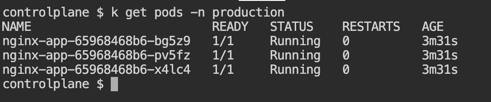

1. Create a production namespace

kubectl create namespace production

2. Create configmap

kubectl create configmap app-config \
  --from-literal=APP_ENV=production \
  --namespace=production

3. PROD Secrets

kubectl create secret generic app-secret \
  --from-literal=DB_PASSWORD=prodpassword321123 \
  --namespace=production

4. Create prod-deployment.yaml file from template

sed -e 's/PLACEHOLDER_NAMESPACE/production/' \
    -e 's/replicas: .*$/replicas: 3/' app-deployment-template.yaml > prod-deployment.yaml

5. Deploy deployments in production

kubectl apply -f prod-deployment.yaml

6. Expose the production environment

kubectl expose deployment nginx-app \
  --type=NodePort \
  --name=nginx-service \
  --port=80 \
  --target-port=80 \
  --namespace=production

  